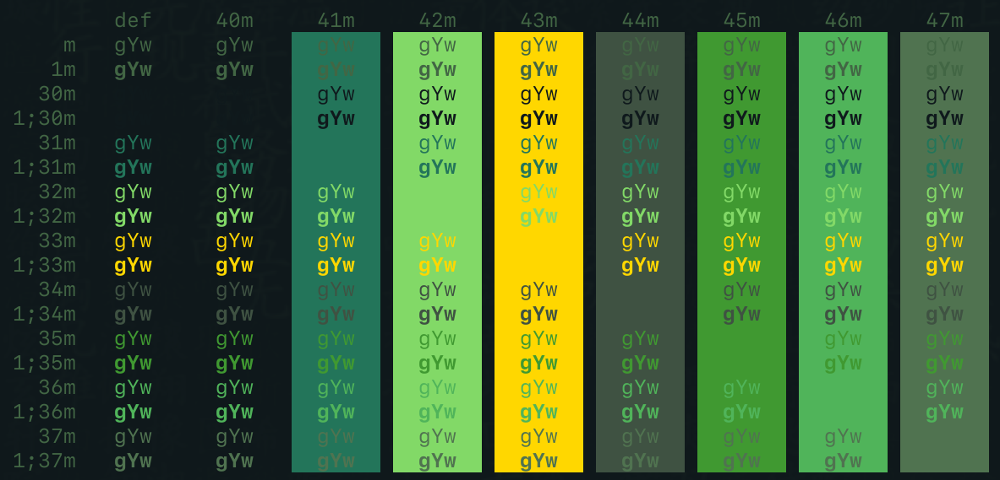
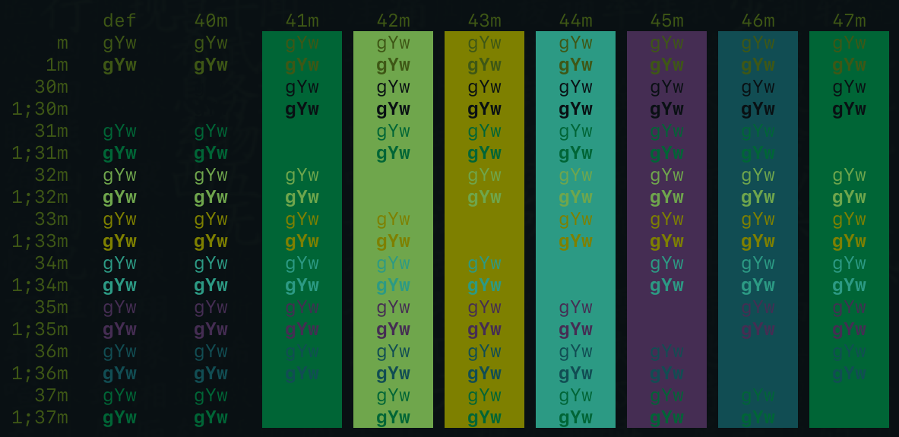
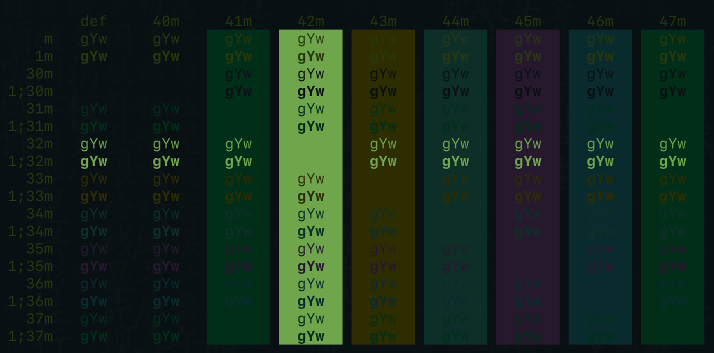

# term-themes

Terminal themes I created. To save and ease my eyes for lo000ong coding time.

## Matrix

## Dark Matrix

## Darker Matrix

## color palette script is stolen from mbadolato/iTerm2-Color-Schemes.
